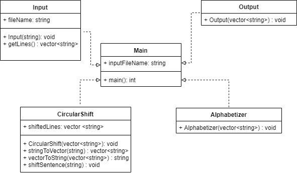
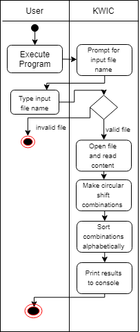
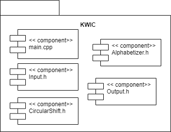
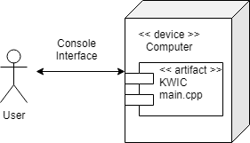
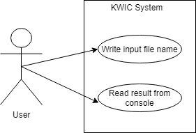

Abril Marina González Ramírez A01280904\
Juan Luis Flores Garza A01280767\
Sergio Díaz Navarro\
Miguel Bazán Aviña A01281010

# KWIC_Archillects
KeyWord-In-Context (KWIC) system - Software Design and Architecture Activity

The KWIC index system accepts an ordered set of lines; each line is an ordered set of words, and each word is an ordered
set of characters. Any line may be “circularly shifted” by repeatedly removing the first word and appending it at the end
of the line. The KWIC index system outputs a list of all circular shifts of all lines in alphabetical order.

KeyWord-In-Context (KWIC) system\
	**input:** strings, each of which consists of several words.\
	**output:** a sorted list of all orderings of each input string.

Example of KWIC operation
- **input**\
		“Clouds are white.”\
		“Pittsburgh is beautiful.”
- **output**\
		are white clouds\
		beautiful pittsburgh is\
		clouds are white\
		is beautiful pittsburgh\
		pittsburgh is beautiful\
		white clouds are

## Software Architecture

### Logic View

### Process View

### Development View

### Physical View

### Scenario View

## How to Run
Compile and run from terminal\
	`g++ main.cpp -o KWIC`\
	`./KWIC`

Write input\
	`example.txt`

## Result

